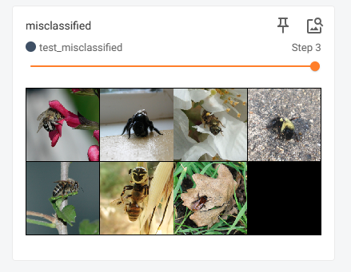
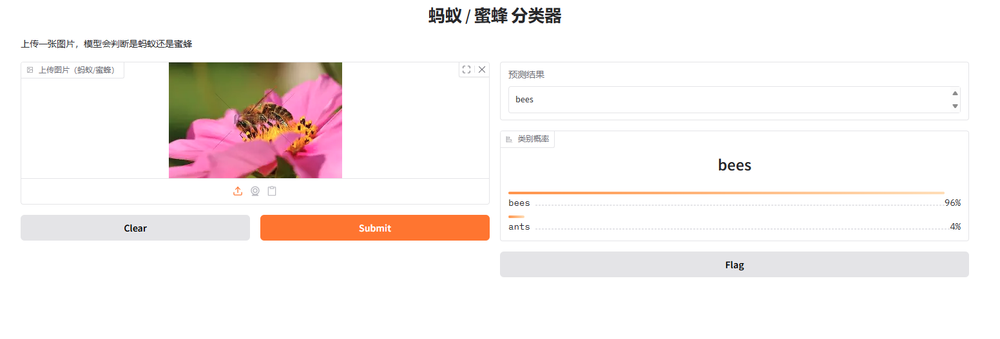

# ResNet_bee_or_ants
使用resnet识别蚂蚁还是蜜蜂

模型训练结果：

预测结果(部分)：
>使用设备: cpu
类别: ['ants', 'bees']
开始测试，总共有 3 个批次...
批次 1/3: 准确率=0.7969, 样本数=64
  样本 1: 标签=ants(0), 预测=ants(0) ✓
  样本 2: 标签=ants(0), 预测=ants(0) ✓
  样本 3: 标签=ants(0), 预测=ants(0) ✓
  样本 4: 标签=ants(0), 预测=ants(0) ✓
  样本 5: 标签=ants(0), 预测=ants(0) ✓
批次 2/3: 准确率=0.7188, 样本数=64
  样本 1: 标签=ants(0), 预测=ants(0) ✓
  样本 2: 标签=ants(0), 预测=ants(0) ✓
  样本 3: 标签=ants(0), 预测=ants(0) ✓
  样本 4: 标签=ants(0), 预测=bees(1) ✗
  样本 5: 标签=ants(0), 预测=ants(0) ✓
批次 3/3: 准确率=0.7200, 样本数=25
  样本 1: 标签=bees(1), 预测=bees(1) ✓
  样本 2: 标签=bees(1), 预测=bees(1) ✓
  样本 3: 标签=bees(1), 预测=bees(1) ✓
  样本 4: 标签=bees(1), 预测=bees(1) ✓
  样本 5: 标签=bees(1), 预测=ants(0) ✗
=== 测试完成 ===
总测试样本数: 153
测试准确率: 0.7516
正确预测数: 115.0
错误预测数: 38.0
进程已结束，退出代码为 0

识别错误案例:

可视化检测：
